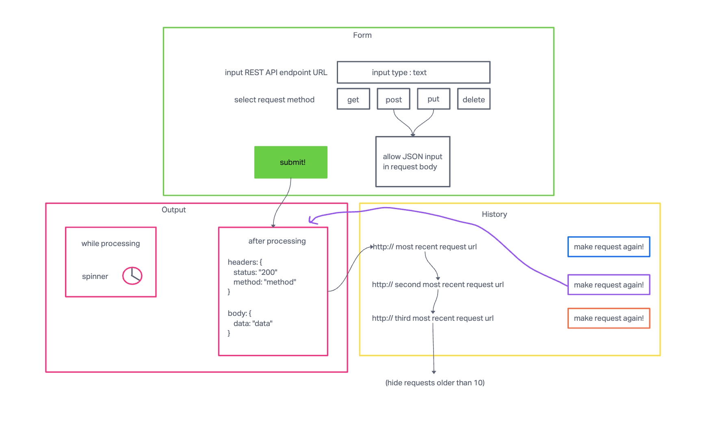

# resty

## UML



## LAB 28 BELOW THIS LINE

----------------------

### LAB - Component Lifecycle / useEffect() Hook  

RESTy Phase 3: Connect RESTy with APIs, running live requests.  

### Phase 3 Requirements

In phase 3, we will be connecting RESTy to live APIs, fetching and displaying remote data. Our primary focus will be to service GET requests.

The following user stories detail the major functionality for this phase of the project.

As a user, I want to enter the URL to an API and issue a GET request so that I can retrieve it's data.  
As a user, I want to see the results returned from an API request in my browser in a readable format.  

Application Flow:

User enters an API URL.  
Chooses a REST Method.  
Clicks the "Go" button.  
Application fetches data from the URL given, with the method specified.  
Displays the response headers and results separately.  
Both headers and results should be "pretty printed" JSON.  
One possible design/layout. Please use your judgement and taste in styling your version of this application.  

### Technical Requirements / Note Lab 28

Extend your application to include the ability to send http requests and display response data, when the `<Form />` component experiences a submission event.  

Refactor application methods to allow for browser side HTTP requests to be sent.  
Your implementation should allow the user to set a url, method, and request body.  
Make sure all relevant request and response data is displayed to the User.  

Suggested approach:

`<Form />` component, onSubmit() sends the user's entries to the `<App />` via method sent in through props.  
`<App />` does a check on the request data from the form and updates the request variable in state with the url, method, and potentially the body.  
`<App />` has an effect hook that's looking for changes to the request variable in state, and in response, runs the API request with the new request options from state.  
`<App />` updates state with the results of the API Request.  
`<Results />` sees the new API data as a prop and renders the JSON.  

// DONE
// added react-json-formatter to pretty print JSON data
Note: update your `<Results />` component to use a 3rd party component to "pretty print" the JSON in a color-coded, user-friendly format.

### Proposed File Structure Lab 28

In this proposal:

Utilize Airbnb React/JSX Style Guide conventions.  
Unit tests are placed in the component directory (testing one file only).  
Integration tests are placed in the __tests__ directory (testing more than one file).  

``` bash
├── .github  
│   ├── workflows  
│   │   └── node.yml  
├── public  
├── src  
│   ├── __tests__  
│   │   │   └── App.test.jsx (integration test)  
│   ├── Components  
│   │   ├── Footer  
│   │   │   ├── Footer.scss  
│   │   │   ├── Footer.test.jsx (unit test)  
│   │   │   └── index.jsx  
│   │   ├── Form  
│   │   │   ├── Form.scss  
│   │   │   ├── Form.test.jsx   
│   │   │   └── index.jsx  
│   │   ├── Header  
│   │   │   ├── Header.scss  
│   │   │   ├── Header.test.jsx  
│   │   │   └── index.jsx  
│   │   └── Results  
│   │       ├── index.jsx  
│   │       ├── Results.scss  
│   │       └── Results.test.jsx  
│   ├── App.jsx  
│   ├── App.scss  
│   └── index.js  
├── .gitignore  
├── package-lock.json  
├── package.json  
└── README.md  
```

### Tests Lab 28

Utilize the React Testing Library framework installed with CRA.  
Assert that upon form submission the resulting data will be rendered in the output area.  
You will need to "mock" the API request with React Testing Library.  
install msw.  
Note the example here.  
This shows how to use the msw package to setup a fake server that returns fake data in your tests so that you can run tests without having to call an actual API.  

### Stretch Goals Lab 28

Add support for all REST methods.

GET a single record by ID.  
DELETE a single record by ID.  
PUT a single record by ID.  
Requires the addition of a text area where you can type in the JSON body for the update.  
POST to create a new record.  
Requires the addition of a text area where you can type in the JSON body for the new record.  

## LAB 27 BELOW THIS LINE

----------------------

### LAB - useState() Hook

RESTy Phase 2: Retrieving User Input and Managing State.

### Phase 2 Requirements

In phase 2, we will be receiving user input in preparation of connecting to live APIs, using the useState() hook in our functional components. In order to properly manage state with the useState hook, we will now convert `<App />` to a functional component.

The following user stories detail the major functionality for this phase of the project.

As a user, I want to enter the REST Method and URL to an API.  
As a user, I want to see a summary of my request as well as results returned from an API request in my browser in a readable format.

### Application Flow Lab 27

User enters an API URL.  
Chooses a REST Method.  
Clicks the “Go” button.  
Application fetches data from the URL given, with the method specified.  
Displays the response headers and results separately.  
Both headers and results should be “pretty printed” JSON.  
One possible design/layout.  
Please use your judgement and taste in styling your version of this application.  

### Technical Requirements Lab 27

// DONE
Extend your React Application so that your functional components are able to manage their own state variables using the useState() Hook.  
NOTE: It is not a requirement to make the actual API call. That can be mocked with “fake” data.

// DONE
Refactor any components using this.setState() to implement the useState() react API hook.  
Refactor the Form Component to implement user input from form elements, instead of hard coded string values.  

Suggested Component Hierarchy and Application Architecture:

index.js - Entry Point.

`<App />` - Container.  
Holds application state: The Request (from the form) and the Response (from the API).  
Hook that can update state.  
Renders 2 Child Components.  

`<Form />`  
Expects a function to be sent to it as a prop.  
Renders a URL entry form.  

A selection of REST methods to choose from (“get” should be the default).  
The active selection should be displayed/styled differently than the others.  
Renders a Textarea to allow the user to type in a JSON object for a POST or PUT request.  

On submit:  
Send the Form entries back to the `<App />` using the method sent down in props.  
Form will run the API request.  
Toggle the “loading” status before and after the request.  

`<Results />`  
Conditionally renders “Loading” or the data depending on the status of the request.  
Renders the data as “pretty” JSON.  
Proposed File Structure  

In this proposal:

Utilize Airbnb React/JSX Style Guide conventions.  
Unit tests are placed in the component directory (testing one file only).  
Integration tests are placed in the __tests__ directory (testing more than one file).  

``` bash
├── .github  
│   ├── workflows  
│   │   └── node.yml  
├── public  
├── src  
│   ├── __tests__  
│   │   │   └── App.test.jsx (integration test)  
│   ├── Components  
│   │   ├── Footer  
│   │   │   ├── Footer.scss  
│   │   │   ├── Footer.test.jsx (unit test)  
│   │   │   └── index.jsx  
│   │   ├── Form  
│   │   │   ├── Form.scss  
│   │   │   ├── Form.test.jsx  
│   │   │   └── index.jsx  
│   │   ├── Header  
│   │   │   ├── Header.scss  
│   │   │   ├── Header.test.jsx  
│   │   │   └── index.jsx  
│   │   └── Results  
│   │       ├── index.jsx  
│   │       ├── Results.scss  
│   │       └── Results.test.jsx  
│   ├── App.jsx  
│   ├── App.scss  
│   └── index.js  
├── .gitignore  
├── package-lock.json  
├── package.json  
└── README.md  =
```

### Tests Lab 27

Utilize the React Testing Library framework installed with CRA.  
Assert that upon form submission the resulting data will be rendered in the output area.  
Install the GitHub action that will auto-run your tests on all check-ins.  

### Stretch Goals Lab 27

Connect the App component to an API and make an actual call (focusing on GET) to the URL requested in the form.

## LAB 26 BELOW THIS LINE

----------------------

### LAB - Component Based UI

RESTy Phase 1: Begin work on the RESTy API testing application.

Create a UML diagram of the RESTy system on a whiteboard before you start.

// DONE  
Use Create React App (CRA) to create a new application named resty.  
Delete the existing src directory.  
Paste in the src directory from the lab/starter-code.  
Run npm install uuid sass.  
npm start and confirm that the application loads in the browser.  
Create an EMPTY GitHub Repository named resty.  
Follow GitHub instructions labeled “…or push an existing repository from the command line”.  
Note: after completing the above step, CRA starter code will have been pushed to your GitHub Repo.  
Immediately ACP after adding your newly created repo to GitHub; giving you the option to rollback changes to the base starter code if necessary.  
Create and work in a new branch for today called base.  

### Phase 1 Requirements

Today, we begin the first of a 4-Phase build of the RESTy application, written in React. In this first phase, our goal is to setup the basic scaffolding of the application, with intent being to add more functionality to the system as we go. This initial build sets up the file structure so that we can progressively build this application in a scalable manner.

### Technical Requirements / Notes Lab 26

The application, as written by our development team was done using class components as a proof of concept. In order to go to production, we’re going to have to convert this to an application written using React function components so that our foundation is both stable and high performing.

Refactor the RESTy application as follows:

// DONE  
Convert all child components of `<App />` from classes to functions.  
The `<App />` component serves as the container for all sub-components of this application.
Leave this component as a Class.  

// DONE  
Make sure all base styles for `<App />` are included in a .scss imported within the App.jsx file.  
Ensure that the `<Header />`, `<Footer />`, `<Results />` and `<Form />` components are imported using ES6 import syntax.  
Use .scss files to style each component.  
Each of the components use their own .scss file for styling.  

// DONE  
Core application functionality should remain unchanged.  
The `<Form />` component should:  
Call a function onSubmit() that updates the `<App />` component via a function sent down as a prop so that the app can process the form values.  
The `<Results />` component should show mock API results.  

### Proposed File Structure Lab 26

In this proposal:

Utilize Airbnb React/JSX Style Guide conventions.  
Unit tests are placed in the component directory (testing one file only).  
Integration tests are placed in the __tests__ directory (testing more than one file).  

``` bash
├── .github
│   ├── workflows
│   │   └── node.yml
├── public
├── src
│   ├── __tests__
│   │   │   └── App.test.jsx (integration test)
│   ├── Components
│   │   ├── Footer
│   │   │   ├── Footer.scss
│   │   │   ├── Footer.test.jsx (unit test)
│   │   │   └── index.jsx
│   │   ├── Form
│   │   │   ├── Form.scss
│   │   │   ├── Form.test.jsx
│   │   │   └── index.jsx
│   │   ├── Header
│   │   │   ├── Header.scss
│   │   │   ├── Header.test.jsx
│   │   │   └── index.jsx
│   │   └── Results
│   │       ├── index.jsx
│   │       ├── Results.scss
│   │       └── Results.test.jsx
│   ├── App.jsx
│   ├── App.scss
│   └── index.js
├── .gitignore
├── package-lock.json
├── package.json
└── README.md
```

### Testing Lab 26

NOTE: For this assignment, testing is not required.

### Stretch Goal Lab 26

Attempt Testing!

Utilize the React Testing Library framework installed with CRA.  
Assert that components render elements with language on page load.  
Import { fireEvent, render, screen } from the React Testing Library to confirm behavior when change and/or click events occur.  
See Documentation as necessary. Examples will soon be given in lecture.  

